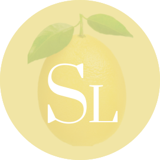

<p align="center">
  <a href="" rel="noopener">
 </a>
</p>

<h1 align="center">Sustainable Lemons</h1>

<div align="center">

<a href="https://opensource.org/licenses/MIT"></a>
<a href="https://opensource.org/licenses/BSD-2-Clause"></a>

</div>

## Description

Sustainable Lemons is an ecommerce website. This repo contains the back-end for that website.

## Installation

1. Clone this repo to your local device.
2. Enter "npm init -y" in the CLI (to access the node.js package)
3. Install the packages below:

```
-> dotenv
-> express
-> mysql2
-> Sequelize

```

## Usage

The contents in this repo includes a schema for the database being used.
The funtionality of this repo is to allow CRUD operations for merchandise, specifically categories, products and tags.

## Built With

- JavaScript
- Node.js
- Express.js
- Sequelize
- MySQL2
- Dotenv

## Website

Here is a [video of Sustainable Lemon's functionality.]().

</a>

## Contribution

Made with ❤️ by Nicole Barranca

## Questions

Feel free to contact me directly at nikkibarranca@gmail.com if you have any questions about the repo.

You can find more of my work at [Nicole Barranca](https://github.com/NicoleBarranca).
